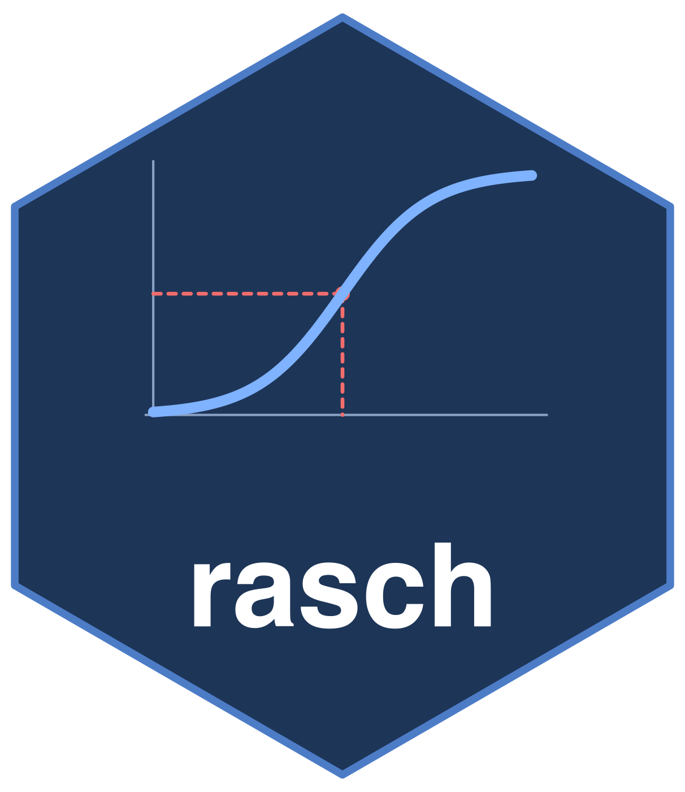

# rasch: Models and Diagnostics for Rasch Measurement Theory 

<!-- badges: start -->
[](https://CRAN.R-project.org/package=rasch)
[](https://github.com/drjoshmcgrane/rasch/actions/workflows/R-CMD-check.yaml)
[](https://drjoshmcgrane.github.io/rasch/)
<!-- badges: end -->

`rasch` fits and evaluates models within Rasch Measurement Theory. It includes
models for item responses, explanatory item and threshold structures,
multiple ratings, linked frames of reference, and paired comparisons, with a
common set of functions for examining fit, invariance, targeting,
dimensionality, and local dependence.

The original dichotomous model is (Rasch, 1960)

$$
\log\frac{P(X_{ni}=1)}{P(X_{ni}=0)}=\theta_n-\delta_i,
$$

which is distinguished among item response models by its sufficiency and
invariance properties: the total score is sufficient for the person
parameter, so items can be compared independently of the persons who
responded. This sufficiency allows item locations to be estimated by
pairwise conditioning (Zwinderman, 1995): given exactly one
of items $i$ and $j$ correct, the person parameter cancels,

$$
\log\frac{P(X_{ni}=1 \mid X_{ni}+X_{nj}=1)}{P(X_{nj}=1 \mid X_{ni}+X_{nj}=1)}=\delta_j-\delta_i,
$$

which is equivalent to the standard model for comparative judgement
(Andrich, 1978a; Bradley and Terry, 1952; Luce, 1959). The extensions keep
this structure: partial credit and rating scale models add ordered
thresholds (Andrich, 1978b; Masters, 1982); the many-facet model adds rater
and task locations to the composite (Linacre, 1989); the extended frame of
reference model links frames measured in different units (Humphry and
Andrich, 2008); polytomous comparative judgement applies the thresholds to
ordered pair judgements (Tutz, 1986). The linear logistic test model and
linear partial credit model express item or threshold locations as functions
of observed characteristics (Fischer, 1973; Fischer and Ponocny, 1994). The
same explanatory formulation can be applied to object locations in
dichotomous or ordered comparative judgements.

The package treats fit to the model as an empirical question. Its diagnostics
examine whether comparisons remain invariant across persons, items, groups,
occasions, raters, and other parts of the measurement design.

## Models

| Function | Model |
|---|---|
| `rasch()` | Dichotomous Rasch, partial credit, and rating scale models |
| `rasch_mfrm()` | Many-facet Rasch model |
| `rasch_efrm()` | Extended frame of reference model |
| `rasch_explanatory()` | Linear logistic test and linear partial credit models |
| `btl()` | Comparative judgement models for dichotomous and polytomous paired comparisons |
| `btl_efrm()` | Extended frame of reference model for paired comparisons |
| `btl_explanatory()` | Explanatory comparative judgement models |
| `pl()` | Plackett-Luce model for rankings |
| `rasch_cj()` | Joint calibration of items or persons from responses, paired comparisons and rankings |

Person measures are estimated by weighted likelihood (Warm, 1989).
Externally imposed item or item-set weights can be used for a supplementary
person measure without changing the fitted calibration or its diagnostics.
Anchored estimation is available for equating, and incomplete linked
designs can be fitted when their observed response structure identifies a
common scale.

The item-response models follow Rasch (1960) and Andrich and Marais (2019).
The explanatory item models follow Fischer (1973) and Fischer and Ponocny
(1994), within the explanatory framework of De Boeck and Wilson (2004). Continuous, categorical or ordinal characteristics may be used; the
comparative-judgement formulation applies the same fixed design to
Bradley–Terry–Luce object locations.
The frame models follow Humphry (2005) and Humphry and Andrich (2008). The
comparative judgement models follow Bradley and Terry (1952), Luce (1959),
Andrich (1978a), and Tutz (1986).

## Shiny application

The package includes a graphical interface for analysts who do not normally
work in R. Launch it after installation with:

```r
rasch::run_app()
```

The application imports data, assigns variables to their measurement roles,
fits the selected model, and displays the resulting tables and plots. An
analysis can be saved as a `.rasch` project and reopened with its data roles
and estimation settings. Tables, figures and HTML, Word or PDF reports can be
downloaded. The R code for each result is shown in the interface. Its
fit bootstrap calibrates item and person fit, or pair, object and judge fit
for comparative judgement, in a cancellable background process. Its adjusted
probabilities refer to the fitted global null, separately for each statistic.
Rankings are analysed on their own page, and paired comparisons or rankings
of the items uploaded beside the responses are calibrated jointly with them
and anchor the analysis.
The simulation page generates each supported data structure, with controls for
its principal parameters and planted departures.
Simulated data can be downloaded as a CSV or together with the generating call,
true values and explanatory metadata.

<p align="center">
  
</p>

## Installation

Install the CRAN release with:

```r
install.packages("rasch")
```

The development version is available from GitHub:

```r
# install.packages("remotes")
remotes::install_github("drjoshmcgrane/rasch")
```

## Example

```r
library(rasch)

d <- simulate_rasch(
  n_persons = 500,
  n_items = 10,
  n_groups = 2,
  seed = 1
)

fit <- rasch(d, model = "PCM", id = "id", factors = "group")

summary(fit)
fit_summary_table(fit)
targeting_table(fit)
dif <- dif_anova(fit)
residual_correlations(fit)
dimensionality_test(fit, B = 99, seed = 1)

# Optional sensitivity analysis for the DIF reference distribution
dif_bootstrap(fit, dif, B = 999, seed = 1)

# Calibrated item and person fit (use more replicates for a final analysis)
boot <- fit_bootstrap(fit, B = 199, seed = 1)
boot$items
boot$persons

plot_pimap(fit)
plot_icc(fit, "I05", group = "group")

# WrightMap is an optional dependency
wright_map(fit, person_panels = "group")
```

The DIF bootstrap is a sensitivity analysis under the fitted global invariant
null. The adjusted residual analysis remains primary.

The [function reference](https://drjoshmcgrane.github.io/rasch/reference/index.html)
documents the data requirements and returned values for each analysis. The
[vignettes](https://drjoshmcgrane.github.io/rasch/articles/) begin with the
data structures required by each model and cover the Rasch
workflow, many-facet and extended-frame models, comparative judgement,
explanatory modelling, repeated-measures DIF and validation.

## References

Andrich, D. (1978a). Relationships between the Thurstone and Rasch
approaches to item scaling. *Applied Psychological Measurement*, 2(3),
451–462.

Andrich, D. (1978b). A rating formulation for ordered response categories.
*Psychometrika*, 43(4), 561–573.

Andrich, D., and Marais, I. (2019). *A Course in Rasch Measurement Theory:
Measuring in the Educational, Social and Health Sciences*. Springer.

Bradley, R. A., and Terry, M. E. (1952). Rank analysis of incomplete block
designs: I. The method of paired comparisons. *Biometrika*, 39(3/4),
324–345.

De Boeck, P., and Wilson, M. (Eds.). (2004). *Explanatory Item Response
Models: A Generalized Linear and Nonlinear Approach*. Springer.

Fischer, G. H. (1973). The linear logistic test model as an instrument in
educational research. *Acta Psychologica*, 37(6), 359–374.

Fischer, G. H., and Ponocny, I. (1994). An extension of the partial credit
model with an application to the measurement of change. *Psychometrika*,
59(2), 177–192.

Humphry, S. M. (2005). *Maintaining a Common Arbitrary Unit in Social
Measurement*. PhD thesis, Murdoch University.

Humphry, S. M., and Andrich, D. (2008). Understanding the unit in the Rasch
model. *Journal of Applied Measurement*, 9(3), 249–264.

Linacre, J. M. (1989). *Many-Facet Rasch Measurement*. MESA Press.

Luce, R. D. (1959). *Individual Choice Behavior: A Theoretical Analysis*.
Wiley.

Masters, G. N. (1982). A partial credit model for scoring responses with
ordered categories. *Psychometrika*, 47(2), 149–174.

Rasch, G. (1960). *Probabilistic Models for Some Intelligence and Attainment
Tests*. Danish Institute for Educational Research. Expanded edition,
University of Chicago Press, 1980.

Tutz, G. (1986). Bradley-Terry-Luce models with an ordered response. *Journal
of Mathematical Psychology*, 30(3), 306–316.

Warm, T. A. (1989). Weighted likelihood estimation of ability in item
response theory. *Psychometrika*, 54(3), 427–450.

Zwinderman, A. H. (1995). Pairwise parameter estimation in Rasch models.
*Applied Psychological Measurement*, 19(4), 369–375.

## Citation

Use `citation("rasch")` to obtain the citation for the installed version.
